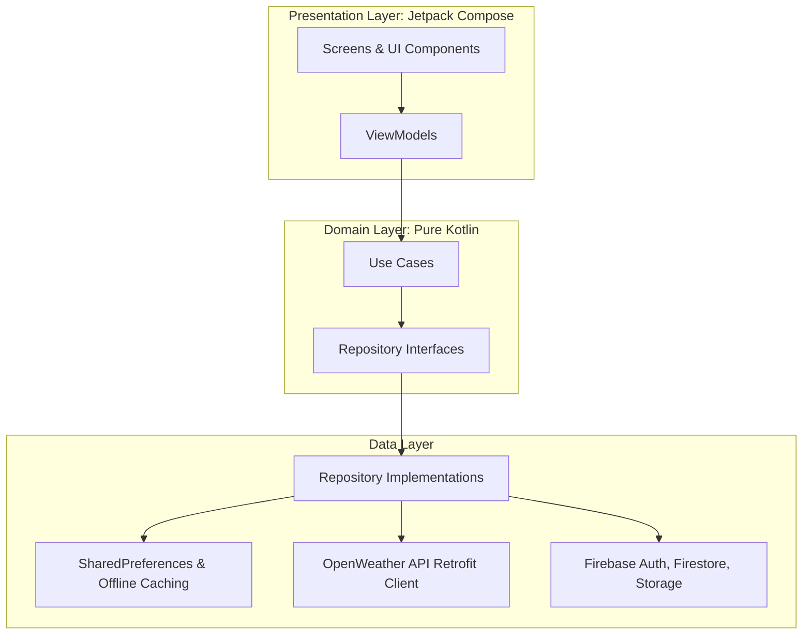
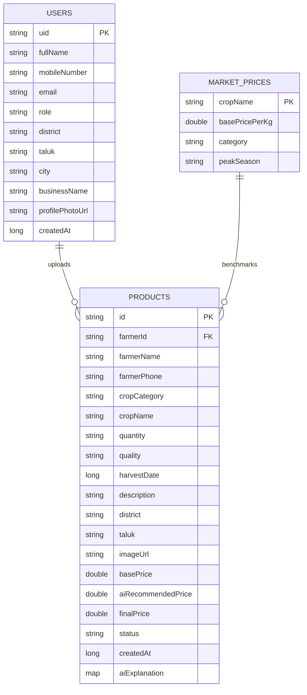
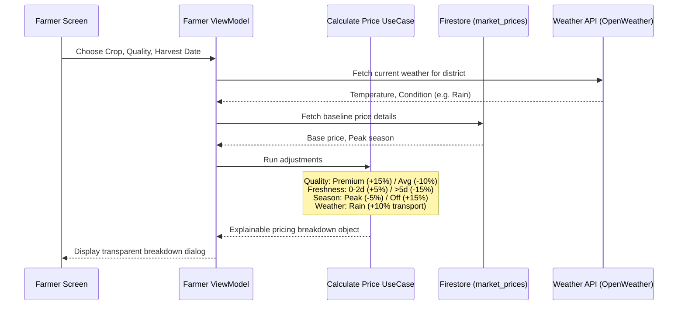

# KrishiAI – AI-Powered Farmer Marketplace (VTU Mini Project)

KrishiAI is a production-quality, modern Android application built using Kotlin, Jetpack Compose, Material 3, and Firebase. It empowers farmers in Karnataka to check localized weather-adjusted pricing recommendations computed via a transparent, explainable AI model, and list crops directly to verified buyers without middlemen.

---

## Technical Architecture

The application is structured following **Clean Architecture**, **MVVM**, and the **Repository Pattern** to ensure decopulability, ease of testing, and maintainability:



---

## Diagrams & System Design

### 1. Entity-Relationship (ER) Diagram
Shows our Firestore collection relationships:



### 2. Use Case Diagram
Maps role interactions:

```mermaid
left-to-right direction
actor Farmer as "Farmer User"
actor Buyer as "Buyer User"

rectangle KrishiAI {
    usecase UC1 as "Register / Login (Role-based)"
    usecase UC2 as "Fetch Current Weather"
    usecase UC3 as "Run AI Pricing Engine"
    usecase UC4 as "Publish Crop Listing"
    usecase UC5 as "Update Product Status (Sold/Reserved)"
    usecase UC6 as "Search & Advanced Filters"
    usecase UC7 as "View Explainable Price Breakdown"
    usecase UC8 as "Contact Farmer via Phone Dialer"
}

Farmer --> UC1
Farmer --> UC2
Farmer --> UC3
Farmer --> UC4
Farmer --> UC5

Buyer --> UC1
Buyer --> UC6
Buyer --> UC7
Buyer --> UC8
```

### 3. API & AI Pricing Algorithm Flow
Illustrates calculations and data collection:



---

## Database Schemas (Firestore)

1. **`users` Collection**:
   - Primary Key: Document ID = `uid` (Firebase Auth UID)
   - Schema mapping:
     - `fullName`: String (e.g., `"Basavaraj Gowda"`)
     - `mobileNumber`: String (e.g., `"9876543210"`)
     - `email`: String (e.g., `"basavaraj@krishi.com"`)
     - `role`: String (value: `"Farmer"` or `"Buyer"`)
     - `district`: String (e.g., `"Mandya"`)
     - `taluk`: String (Farmers only, e.g., `"Maddur"`)
     - `city`: String (Buyers only, e.g., `"Bengaluru"`)
     - `businessName`: String (Optional, e.g., `"Gowda Organic Farms"`)
     - `profilePhotoUrl`: String (URL matching image in Firebase Storage)
     - `createdAt`: Long (Epoch timestamp)

2. **`products` Collection**:
   - Primary Key: Document ID = `id` (Auto-generated UUID)
   - Schema mapping:
     - `farmerId`: String (references `users.uid`)
     - `farmerName`: String
     - `farmerPhone`: String
     - `cropCategory`: String (value: `"Vegetables"` or `"Fruits"`)
     - `cropName`: String (e.g., `"Tomato"`)
     - `quantity`: String (e.g., `"800 kg"`)
     - `quality`: String (value: `"Premium"`, `"Good"`, `"Average"`)
     - `harvestDate`: Long (Epoch timestamp)
     - `description`: String
     - `district`: String
     - `taluk`: String
     - `imageUrl`: String (URL matching crop listing photo in Firebase Storage)
     - `basePrice`: Double
     - `aiRecommendedPrice`: Double
     - `finalPrice`: Double
     - `status`: String (value: `"AVAILABLE"`, `"RESERVED"`, `"SOLD"`, `"EXPIRED"`)
     - `createdAt`: Long
     - `aiExplanation`: Map representation of adjustments:
       - `basePrice`: Double
       - `weatherAdjustment`: Double
       - `qualityAdjustment`: Double
       - `seasonalAdjustment`: Double
       - `freshnessAdjustment`: Double
       - `finalPrice`: Double
       - `confidencePercentage`: Int
       - `recommendation`: String

3. **`market_prices` Collection**:
   - Primary Key: Document ID = `cropName` (e.g., `"Mango"`)
   - Schema mapping:
     - `cropName`: String
     - `basePricePerKg`: Double (e.g., `80.0`)
     - `category`: String (value: `"Vegetables"` or `"Fruits"`)
     - `peakSeason`: String (value: `"Summer"`, `"Monsoon"`, `"Winter"`)

---

## Technical Implementation Guide & Setup

Follow these steps to configure and build the application on your system:

### 1. Firebase Integration Setup
1. Open the [Firebase Console](https://console.firebase.google.com/) and click **Add Project** (Name: `KrishiAI`).
2. Add an Android app to the project. Use the package name: `com.krishiai.app`.
3. Download the generated `google-services.json` file and place it in the application project folder under `app/` (replacing the existing dummy file `app/google-services.json`).
4. Enable the following services in your Firebase Console:
   - **Authentication**: Enable Email/Password signup method.
   - **Cloud Firestore**: Start in test mode. (Offline persistence is auto-handled by Hilt/Firestore settings).
   - **Cloud Storage**: Start in test mode. Used for crop listing images.

### 2. Live Weather API Setup
1. Visit [OpenWeather API](https://openweathermap.org/api) and register for a free account.
2. Generate a free API Key.
3. Open `com.krishiai.app.utils.Constants.kt` in Android Studio.
4. Replace `WEATHER_API_KEY` placeholder with your key:
   ```kotlin
   const val WEATHER_API_KEY = "ADD_API_KEY_HERE"
   ```
   *Note: If this key is left empty, the application automatically switches to Simulated Weather fallbacks, ensuring the app remains runnable and presents realistic data during evaluations.*

### 3. Build & Run
1. Open Android Studio (Iguana, Jellyfish, or newer is recommended).
2. Click **Open Project** and select the workspace folder `e:\Codes\Templates\Farmer`.
3. Allow Gradle to download dependencies and sync configuration.
4. Connect an emulator or an Android device via USB debugging.
5. Click the **Run** button or execute the Gradle task `./gradlew assembleDebug` in the terminal to generate the debug APK.
